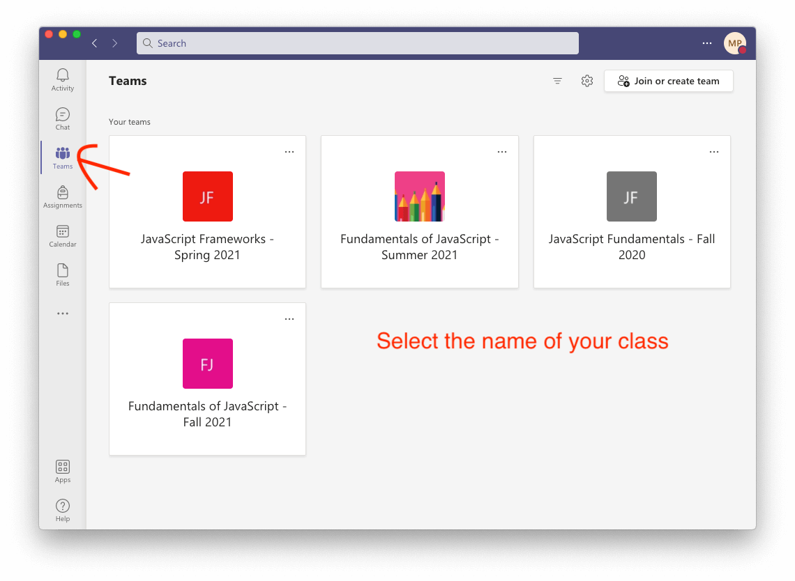
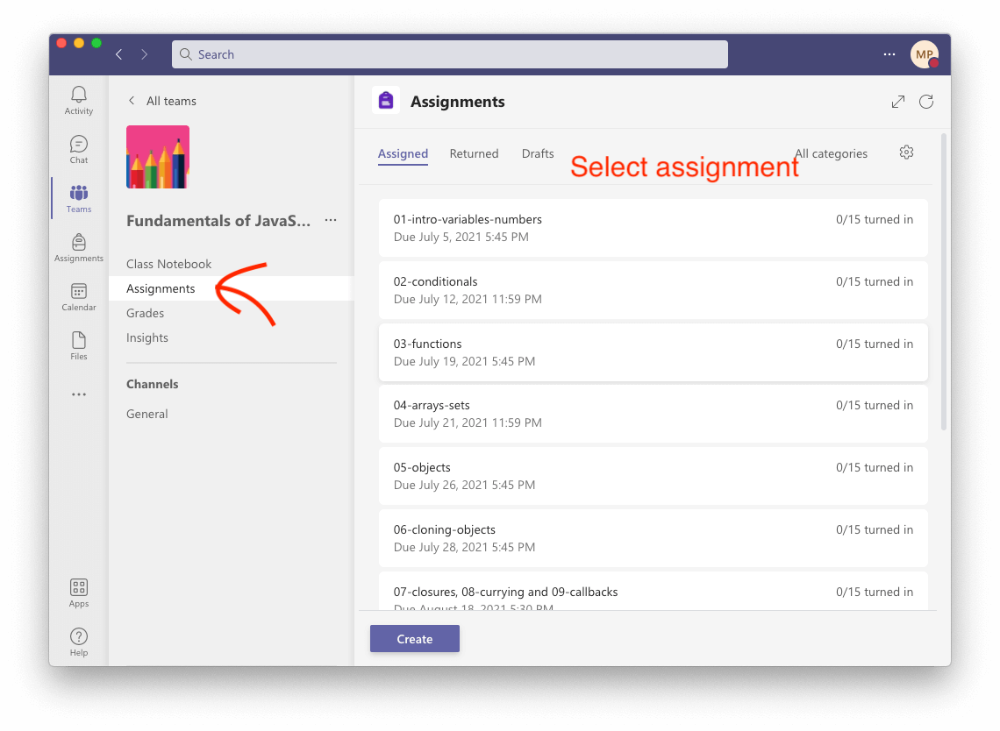

# JavaScript Fundamentals

**[AlbanyCanCode Course](https://albanycancode.org/)**

**Fall 2021**

**Important Note:** This syllabus, along with course assignments and due dates are subject to change. It is the student’s responsibility to check the Slack channel, course materials and updates to the syllabus. Any changes will be clearly noted in course announcements.

## Course Description

Prepare yourself for the world of web applications. This beginner to intermediate level course teaches the fundamentals of JavaScript, building a solid foundation in the language. The goal is that when you finish this class, you are ready to learn React, Angular, Vue.js and other frameworks. We will begin with the very basics of programming and common JavaScript “gotchas” (e.g. scope, shallow cloning vs deep cloning, and _this_ keyword). We will learn how to solve algorithms with features such as callbacks, closures and high order functions. Then we will explore how to make your applications come alive in the browser, how to communicate with a remote server, and finally, how to organize your code.

This course will also introduce you to the tools and practice of the trade. This includes working with command line, building your code, package management, version control with git, unit testing, and Scrum methodology. We usually have guest speakers from local software development firms. This class will give you an opportunity to meet employers and contacts within the capital region.

## Faculty

**Instructors** - Jamal Taylor and Matina Patsos \
**Program Director** - Lee McPeters

## Course Time & Location

### Class

Online Class - Microsoft Teams \
AlbanyCanCode Administration should provide you access to our class's team before class begins

Mondays and Wednesdays \
5:45pm - 8:45pm \
First day of class: 9/27/2021 \
Last day of class: 12/22/2021 \*\
Final project due date: TBA \
Graduation date: TBA

\* You will continue to work on your final project after class ends.

## Prerequisite Knowledge

- HTML
- CSS
- Unix command line is recommended

## Technologies this Class Will Cover

- Unix command line
- Version control with [Git](https://github.com/)
- Package management with [NPM](https://www.npmjs.com/)
- Unit testing
- Webpack
- Visual Studio Code IDE \*
- Browser Developer Tools

\* We will be teaching with Visual Studio Code and highly recommend that you use it too. If you are experienced with programming and the command line, and you believe that you can translate whatever we teach you in Visual Studio Code to your editor of choice, you may opt for another editor, but we will not be able to help you if problems arise.

## Class Policies

### Class Format & Communications

The class will be taught over Microsoft Team's video conferencing. AlbanyCanCode adminstration will give you access and provide training over Microsoft Teams. Please contact either John Sturman or another member of the administrative team for technical support.

Most of the communication outside of class will take place on Slack. Please check it regularly. The class’s public channel is _#jsfun-fall-2021_.

### Grading

In order to receive a certificate of completion, you must follow the conditions of your Student Learning Contract. You must attend at least 75% of classes and you must submit 80% of your work. However, we are willing to be flexible in special circumstances. Please contact the program director and your instructors _as soon as possible_ if something serious is preventing you from participating or submitting your work.

#### Projects

There will be two projects:

**First Project** \
Due: TBA Halfway through the semester \
You can resubmit this project for a better grade, as long as you meet the following requirements: 1) you submit something by due date, even if it is not complete 2.) you resubmit by the last day of class.

**Final Project** \
Due: TBA After class ends \
This project will be made publicly accessible. We will have a virtual graduation, where you project will be shown to employers within the community.

If you do not turn in your projects, you may not receive a certificate of completion.

### Assignments

In addition to your projects, you will be completing in-class and take-home assignments. While you will not be graded on these assignments, we encourage that you do your assignments for your personal benefit. We will ask you to [submit your work through GitHub pull requests](SubmittingAssignments.md) so that we can view your progress.

You can find a list of assignments inside of Teams.

### Getting Help

If you find that you have any trouble keeping up with assignments, technology or other aspects of the course, make sure you let AlbanyCanCode know as early as possible. As you will find, building rapport and effective relationships are key to becoming an effective professional.

While Jamal and Matina would like to help you any way we can, your instructors do have full-time jobs outside of this class and are not always available. We encourage you to message the class channel or ask other students for help. Our staff are also available for 1-on-1 help sessions.

If you have a disability and would like to request accommodations, please contact the instructors during the first week of the semester so that your accommodations may be provided in a timely manner.

### Dropping the Class

If you must drop the course, please contact Annmarie Lanesey at annmarie@albanycancode.org and notify the instructors.

## Schedule

**Important Note:** This schedule, along with course assignments and due dates are subject to change. It is the student’s responsibility to check the Slack channel, course materials and updates to the syllabus. Any changes will be clearly noted in course announcements.

### Weeks 1 - 6

During the first half of class, we will learn the fundamentals of JavaScript and how to solve algorithms. Our lectures will cover:

- Variables
- Primitive Data Types
- Conditionals
- Functions
- Scope
- Collections (Arrays, Sets and Objects)
- High Order Functions

### Weeks 6 - 9

We will then dive into working with JavaScript in the browser, followed by an introduction to how the web works. We will learn how JavaScript communicates with remote web servers via AJAX. We will learn about:

- Document Object Model (DOM)
- Events
- Asynchronous Programming
- HTTP(S) Protocol
- RESTful APIs
- AJAX

### Week 10 - 12

We will then take a look at how to setup and build a JavaScript application as well as how to structure your code. Topics will include:

- Design Patterns
- NPM
- Webpack
- Babel and Browser Backwards Compatibility
- ES6 Modules
- Automated Testing
